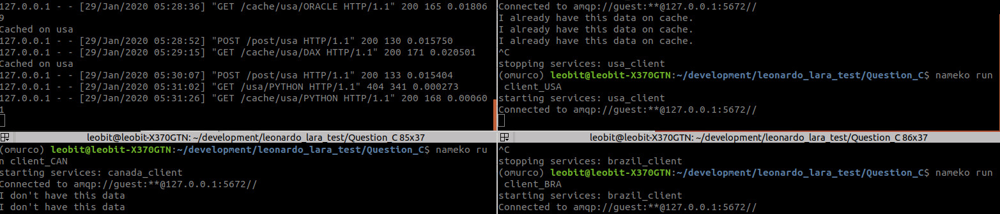
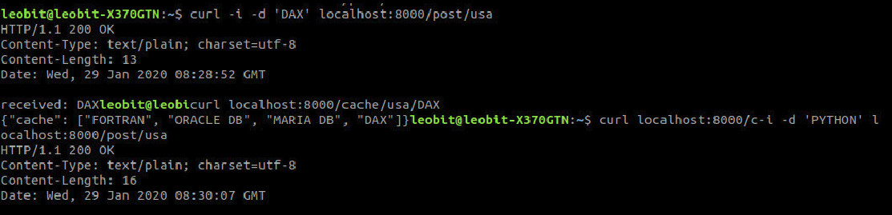

# Geo Distributed LRU

The program uses the microservices architecture, each service has its own cache and the clients (CANADA, USA, BRAZIL) are connected on a central (Server). This program stores the data received by HTTP into some caches.
The great advantage of this structure is the scalability, flexibility and resilient to network problems.

# Installation

- Install Docker ([LINK](https://docs.docker.com/install/))
- Install Docker-compose
- On the root execute ($ docker-compose up)
- Access Server HTTP exposed PORT 8000

# How it works

### - Components

SERVER: (HTTP GET/POST)  
CLIENTS: (CANADA,USA,BRAZIL)  
SERVICES: (canada_client,usa_client,brazil_client)  

### - Endpoints

POST: {ip_server}:8000/post/<string:client_aim>  
GET: {ip_server}:8000/cache/<string:client_aim>/<string:code>

client_aim: The target client for Post or Get
code: The code to be stored in client_aim's cache

### - GET/POST

The Server receive requests by GET/POST

- GET
The server checks if has the requested data (Program Language) and deliver back its cache.
If server hasn't the needed data then it calls a Client (service) by RPC Protocol (Nameko)
Through the RPC the client is able to send its cache to the endpoint.
(Clients Services get_cache())

- POST
The server add the data into its own cache or send to specific client.
(Clients Services add_cache())

### - Server

The SERVER has 2 decorators http from Nameko library exposing 2 entry points.
(do_post() & get_cache())
Whatsmore, it has add_cache() to add new data into cache, and also expire_cache() to delete unnecessary caches.

### - Clients

Clients services manage its own caches and deliver some data to server.
They have add_cache(), get_cache() and expire_cache() functions

### - Missing Functionalities

Locality of reference, data should almost always be available from the closest region
