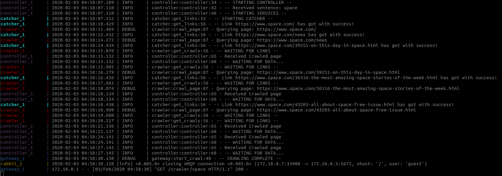

# Info

This Crawler get all information from the mainly pages from google, information like lists, text, code and etc.

The Architecture is based on Microservices in which services have specific tasks and are connected by protocol.

Technologies: Docker, Docker-compose, Flask, Python3.6/3.7, RabbitMQ, Nameko RPC, Redis, NLTK, Loguru

Usage: Request a query in the exposed api: http://0.0.0.0/5000/crawler/"query"

# Crawler System

The system has:

- Scalability
The services are expandable to any number you want. 
The Catcher service has a limitation described below (Limitations)

- Compatibility
Due the fact that each service is in a container, you can easily change the environment for modules,
versions and installations for that specific service.

- Maintainability
It's possible to change a code in a service without affect others services.
The maintenance of the system could be a few changes in docker-compose or dockerfile.

- Uninterruptibility/Continuity
If a service is down the structure will try restart or up another service to continue the operation.

- Quality
The Crawler get good parts of the text, lists, and other tags and returns a JSON String.

- Testability
The system could be tested in a row, but with a break time to avoid block from Google.

# How it Works

Docker-compose starts the orchestration of the containers and install any needed resource for the services:

 - Gateway:
Flask receive a request (query), this query goes to gateway to create an RPC Environment and the services are started:

- Rabbit:
RabbitMQ - APMQ protocol to communicate between services and is used by Nameko RPC.

- Redis:
DataBase NoSql to store and give a data pool for the services.

- Controller:
Control the flow of requisitions  
Get in real time the crawled pages in Redis List ("crawls")  
Deliver data back to gateway

- Catcher:
Get, parse the data from source and stores in a Redis List ("links")

- Crawler:
Get in real time links from Redis List ("links")  
Crawl the link getting all tags  
Tokenize and Remove STOPWORDS using NLTK (Natural Language Tool Kit)  
Find for specific tags and pattern on text  
Store the results in a Redis List ("crawls")

* All processes are 

# How to install

- Install Docker ([LINK](https://docs.docker.com/install/))
- Install Docker-compose
- On the root dir execute:

    <code> docker-compose up </code>

- Access Server HTTP exposed 0.0.0.0/5000

# Limitations

I'm not able to do many requests or increase workers in Catcher service in the system because surely google would block my IP.

# Results

Showing some examples of the application:

## SEARCH: "keystone - Circular reference found role inference"

## SEARCH: "space"

## SEARCH: "Data Science"

