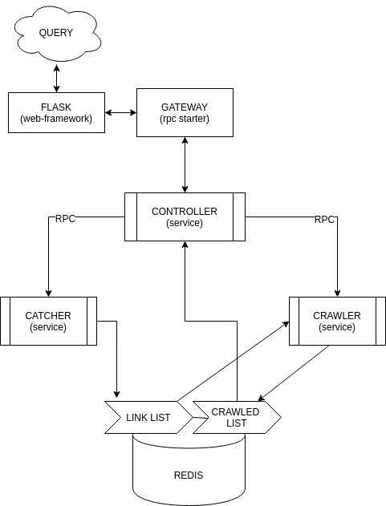
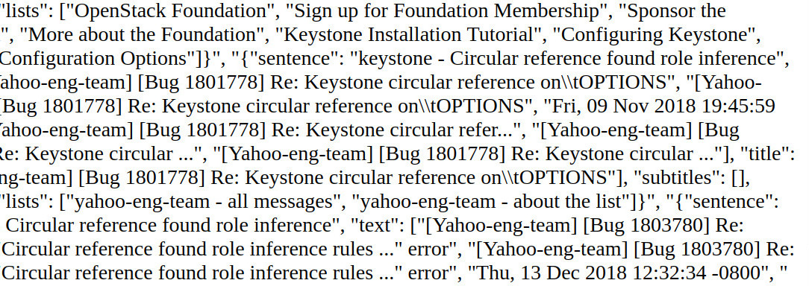
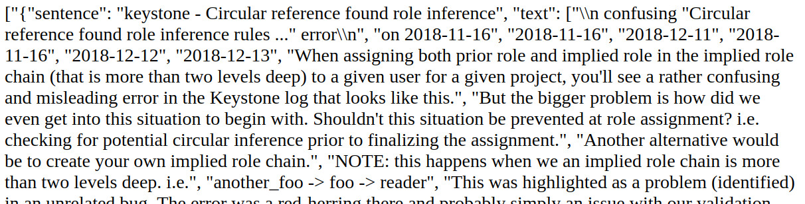
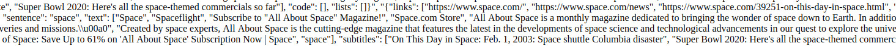
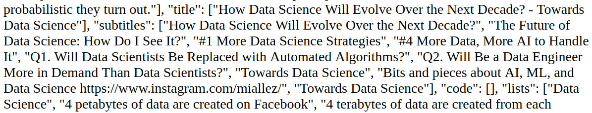

# Crawler

This Crawler get all information from the mainly pages from google, information like lists, text, code and etc.

The Architecture is based on Microservices in which services has specific tasks and are connected by protocol.

Technologies: Docker, Docker-compose, Flask, Python3.6/3.7, RabbitMQ, Nameko RPC, Redis, NLTK

Usage: Request a query in the exposed api: http://0.0.0.0/5000/crawler/query

# How it Works

Docker-compose starts the orchestration of the containers and install any needed resource for the services:

 - Gateway:
Flask receive a request (query), this query goes to gateway to create a RPC Environment and the services are started:

- Rabbit:
RabbitMQ - APMQ protocol to communicate between services and is used by Nameko RPC.

- Redis:
DataBase NoSql to store and give a data pool for the services.

- Controller:
Control the flow of requisitions  
Get in real time the crawled pages in Redis List ("crawls")  
Deliver data back to gateway

- Catcher:
Get, parse the data from source and stores in a Redis List ("links")

- Crawler:
Get in real time links from Redis List ("links")  
Crawl the link getting all tags  
Tokenize and Remove STOPWORDS using NLTK (Natural Language Tool Kit)  
Find for specific tags and pattern on text  
Store the results in a Redis List ("crawls")

# How to install

- Install Docker ([LINK](https://docs.docker.com/install/))
- Install Docker-compose
- On the root dir execute:

    <code> docker-compose up </code>

- Access Server HTTP exposed 0.0.0.0/5000

# Limitations

I'm not able to do many requests or increase workers in the system because surely google will block my IP.

# Results

Showing some examples of the application:

SEARCH: "keystone - Circular reference found role inference"

SEARCH: "space"

SEARCH: "Data Science"

